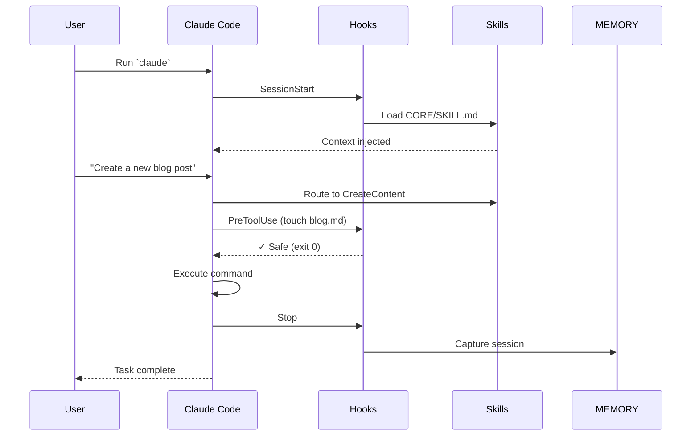

<div align="center">

<picture>
  <source media="(prefers-color-scheme: dark)" srcset="./pai-logo-v7.png">
  <source media="(prefers-color-scheme: light)" srcset="./pai-logo-v7.png">
  
</picture>

<br/>
<br/>

# Personal AI Infrastructure

[](https://github.com/danielmiessler/PAI)

<br/>

<!-- Status Badges -->


<!-- Content Badges -->
[](#-quick-start)
[](Packs/)
[](Bundles/)
[](https://github.com/danielmiessler/PAI/graphs/contributors)

<!-- Tech Stack -->
[](https://claude.ai)
[](https://www.typescriptlang.org/)
[](https://bun.sh)
[](https://danielmiessler.com/upgrade)

<br/>

**Getting Started:** [AI-First Install](#-this-readme-is-for-your-ai-assistant) · [What is PAI?](#what-is-pai) · [New to This?](#wait-hold-onassume-im-new-to-all-this) · [The Algorithm](#the-algorithm-the-centerpiece) · [Principles](#the-pai-principles) · [Primitives](#pai-primitives)

**Installation:** [Packs & Bundles](#packs--bundles) · [How AI Install Works](#how-ai-installation-works) · [Browse Packs](#-available-packs) · [Browse Bundles](#-available-bundles) · [Quick Start](#-quick-start)

**Development:** [Create a Pack](#-for-pack-developers) · [Platform Support](#️-platform-compatibility) · [Contributing](#-contributing)

**Resources:** [FAQ](#-faq) · [Documentation](#-documentation) · [Community](#-community) · [Roadmap](#-roadmap) · [v1 → v2 Journey](#the-journey-pai-v1x--v20) · [Updates](#-update-history)

<br/>

[](https://youtu.be/Le0DLrn7ta0)

**[Watch the full PAI walkthrough](https://youtu.be/Le0DLrn7ta0)** | **[Read: The Real Internet of Things](https://danielmiessler.com/blog/real-internet-of-things)**

---

# AI should magnify everyone—not just the top 1%.

</div>

The most powerful AI systems are being built inside companies for companies. The richest people and the biggest corporations are getting AI that learns from every interaction and gets better at helping them over time.

**Everyone deserves that.**

PAI exists to democratize access to **self-learning AI infrastructure**. Not a chatbot that forgets everything. Not a generic assistant that starts fresh each time. A [*system* that improves itself](https://danielmiessler.com/blog/personal-ai-maturity-model)—one that captures feedback from every interaction, learns from mistakes, and gets better at helping *you* specifically.

**The North Star: Euphoric Surprise.** PAI pursues a singular goal—creating *Euphoric Surprise* in how it executes every task. Not just completion, but results so thorough, thoughtful, and effective that you're genuinely surprised and delighted. This is how PAI helps you become the best version of yourself: by consistently exceeding expectations in service of your goals. The [Personal AI Maturity Model](https://danielmiessler.com/blog/personal-ai-maturity-model) shows where this path leads—from basic chatbots to a true AI companion.

This is open-source. This is free. This is for everyone.

**Who is PAI for?**
- **Developers** using AI coding assistants who want persistent memory and custom workflows
- **Power users** who want their AI to know their goals, preferences, and context
- **Teams** building shared AI infrastructure with consistent capabilities
- **Experimenters** interested in AI system design and personal AI patterns

---

**What makes PAI powerful technically:** It's built to learn from every interaction. Ratings, sentiment, verification outcomes—all captured automatically. A universal algorithm (Current → Ideal via verifiable iteration) drives the work, and the learning loop feeds improvements back into the system. This is what enterprise AI teams build internally. Now it's open-source.

---

> [!TIP]
> ## 🤖 This README Works Great with AI Assistants
>
> **Try AI-assisted installation:** Give this URL to your AI assistant and say *"Walk me through installing PAI and customize it for me."*
>
> The documentation is designed for both humans and AI. Read on to understand the system, or let your AI guide you through setup—whichever works best for you.

---

## What is PAI?

**PAI (Personal AI Infrastructure)** is a **self-learning system** that gets better at helping you over time.

Unlike static AI assistants that treat every conversation as a blank slate, PAI captures feedback from every interaction—explicit ratings, implicit sentiment, behavioral signals, verification outcomes—and uses it to improve. The system literally upgrades itself based on what works and what doesn't.

**PAI is three things:**
- **A continuously upgrading algorithm** - The centerpiece. Current → Ideal via verifiable iteration, at any scale. Everything else exists to feed signals back into improving The Algorithm itself.
- **A self-learning system** - Every interaction generates feedback (ratings, sentiment, verification outcomes) that improves the system.
- **Personal infrastructure** - Skills, memory, and context that make AI actually useful for *your* life

The learning happens automatically. Rate a response poorly? The system captures why. Express frustration? Sentiment analysis detects it. Abandon a task? That's a signal too. All of this feeds back into improving skills, workflows, and even The Algorithm itself.

---

## Wait, Hold On—Assume I'm New to All This

You've probably used ChatGPT or Claude. Type a question, get an answer. Simple.

You can think of it as **three levels**:

<p align="center">
  
</p>

### Level 1: Chatbots

ChatGPT, Claude, Gemini—you ask something, it answers, and then it forgets everything. Next conversation starts fresh. No memory of you, your preferences, or what you talked about yesterday.

**The pattern:** Ask → Answer → Forget

### Level 2: Agentic Platforms

Tools like Claude Code, Cursor, and Windsurf. The AI can actually *do* things—write code, browse the web, edit files, run commands.

**The pattern:** Ask → Use tools → Get result

More capable, but it still doesn't know *you*—your goals, your preferences, your history.

### Level 3: PAI (Personal AI Infrastructure)

Now your AI **learns and improves**:
- **Captures every signal** — Ratings, sentiment, verification outcomes
- **Learns from mistakes** — Failures get analyzed and fixed
- **Gets better over time** — Success patterns get reinforced
- **Upgrades itself** — Skills, workflows, even The Algorithm evolve

Plus it knows:
- **Your goals** — What you're working toward
- **Your preferences** — How you like things done
- **Your history** — Past decisions and learnings

**The pattern:** Observe → Think → Plan → Execute → Verify → **Learn** → Improve

The key difference: **PAI learns from feedback**. Every interaction makes it better at helping *you* specifically.

---

## The Algorithm (THE CENTERPIECE)

**The Algorithm is the gravitational center of PAI—everything else exists to serve it.**

At the foundation of PAI is a universal pattern for accomplishing any task: **Current State → Ideal State** via verifiable iteration. The memory system captures signals. The hook system detects sentiment and ratings. The learning directories organize evidence. All of this feeds back into improving **The Algorithm itself**.

PAI is not a static tool—it is a **continuously upgrading algorithm** that gets better at helping you with every interaction.

This one unified algorithm works at every scale:
- **Fixing a typo** — Current: wrong word. Ideal: right word.
- **Building a feature** — Current: doesn't exist. Ideal: works, tested, deployed.
- **Building a company** — Current: idea. Ideal: profitable business.
- **Human flourishing** — Current: wherever you are. Ideal: the best version of your life.

The algorithm has 7 phases:

<p align="center">
  
</p>

| Phase | What You Do |
|-------|-------------|
| **OBSERVE** | Gather context. Understand where you actually are. |
| **THINK** | Generate ideas. What might work? |
| **PLAN** | Pick an approach. Sequence the work. |
| **BUILD** | Define success criteria. How will you know if it worked? |
| **EXECUTE** | Do the work. |
| **VERIFY** | Test against your criteria. Did it work? |
| **LEARN** | Harvest insights. Iterate or complete. |

The crucial insight: **verifiability is everything**. Most people skip VERIFY. They try things, vaguely check if it worked, and move on. The algorithm's power comes from defining success criteria *before* execution and measuring against them *after*.

> [!TIP]
> **The Algorithm Pack is now available:** [**pai-algorithm-skill**](Packs/pai-algorithm-skill/) provides the full implementation—effort classification, capability loading, ISC (Ideal State Criteria) management, and visual progress tracking.
>
> ⚠️ **Early Alpha:** This pack is in early alpha and not yet fully integrated with the rest of the PAI system. Expect breaking changes and incomplete features as we iterate.

### Where Are You on the Journey?

See the **[Personal AI Maturity Model (PAIMM)](https://danielmiessler.com/blog/personal-ai-maturity-model)**—a 9-tier progression from basic chatbots to a full AI companion.

---

## The PAI Principles

These principles guide how PAI systems are designed and built. **[Full breakdown →](https://danielmiessler.com/blog/personal-ai-infrastructure)**

| # | Principle | Summary |
|---|-----------|---------|
| 1 | **Customization for Your Goals** | PAI exists to help you accomplish your goals. Personalized agentic infrastructure that knows your goals, preferences, context, and history. |
| 2 | **The Continuously Upgrading Algorithm** | **THE CENTERPIECE.** Everything else exists to feed signals back into improving The Algorithm. Current → Ideal via verifiable iteration. |
| 3 | **Clear Thinking First** | Good prompts come from clear thinking. Clarify the problem before writing the prompt. |
| 4 | **Scaffolding > Model** | System architecture matters more than which model you use. |
| 5 | **Deterministic Infrastructure** | AI is probabilistic; your infrastructure shouldn't be. Use templates and patterns. |
| 6 | **Code Before Prompts** | If you can solve it with a bash script, don't use AI. |
| 7 | **Spec / Test / Evals First** | Write specifications and tests before building. Measure if the system works. |
| 8 | **UNIX Philosophy** | Do one thing well. Make tools composable. Use text interfaces. |
| 9 | **ENG / SRE Principles** | Treat AI infrastructure like production software: version control, automation, monitoring. |
| 10 | **CLI as Interface** | Command-line interfaces are faster, more scriptable, and more reliable than GUIs. |
| 11 | **Goal → Code → CLI → Prompts → Agents** | The decision hierarchy: clarify goal, then code, then CLI, then prompts, then agents. |
| 12 | **Skill Management** | Modular capabilities that route intelligently based on context. |
| 13 | **Memory System** | Everything worth knowing gets captured. History feeds future context. |
| 14 | **Agent Personalities** | Different work needs different approaches. Specialized agents with unique voices. |
| 15 | **Science as Meta-Loop** | Hypothesis → Experiment → Measure → Iterate. The Algorithm implements this pattern. |
| 16 | **Permission to Fail** | Explicit permission to say "I don't know" prevents hallucinations. |

---

## PAI Primitives

While the 15 Principles describe the *philosophy* of PAI, the Primitives are the *architecture*—the core systems that make everything work.

**The Algorithm is the central primitive—THE CENTERPIECE.** Everything else exists to feed signals back into improving The Algorithm. Memory captures data. Hooks detect signals. Security protects learning integrity. This is what makes PAI a *continuously upgrading algorithm* rather than just a tool.

| Primitive | What It Does | Key Features |
|-----------|--------------|--------------|
| 🔄 **[The Algorithm](#the-algorithm-the-centerpiece)** | **THE CENTERPIECE.** Continuously upgrading via feedback | Current → Ideal via verifiable iteration. Ratings, sentiment, behavioral signals, verification outcomes → Algorithm upgrades |
| 🧠 **[Memory System](#-memory-system)** | Captures signals for The Algorithm | Three-tier architecture (hot/warm/cold), phase-based learning directories |
| ⚡ **[Hook System](#-hook-system)** | Detects signals for The Algorithm | 8 event types, sentiment detection, rating capture, failure logging |
| 🔒 **[Security System](#-security-system)** | Protects Algorithm integrity | Command validation, repo separation, injection defense |
| 📁 **[User/System Separation](#-usersystem-separation)** | Clean customization boundaries | Portable identity, upgrade-safe |
| 🎯 **[TELOS](#-deep-goal-capture-telos)** | Deep goal understanding | 10 files capturing your mission, beliefs, strategies |
| ⚙️ **[Customization](#-granular-customization)** | Adapt everything to your workflow | 6 levels from identity to memory |

---

<details>
<summary><h3>🔄 The Algorithm (THE CENTERPIECE)</h3></summary>

**This is what makes PAI different.** The entire system exists to serve The Algorithm—a continuously upgrading pattern for accomplishing any task. Every other primitive—Memory, Hooks, Skills—exists to feed signals back into improving The Algorithm itself.

```
                              THE ALGORITHM: Current → Ideal
                                    ┌─────────────────────────────────────┐
                                    │                                     │
User Interaction → Hook Captures → Signal Detection → Learning Directory │
                                                                          │
                ← Algorithm Upgrade ← Pattern Analysis ← Evidence Review ←┘
                                    │                                     │
                                    └─────────────────────────────────────┘
```

**Four Types of Signals That Feed The Algorithm:**

| Type | How It's Captured | Example |
|------|-------------------|---------|
| **Explicit ratings** | User types "7" or "8 - good work" | Direct quality signal |
| **Implicit sentiment** | Hooks analyze user message tone | "This is frustrating" → negative signal |
| **Behavioral signals** | Loopbacks, retries, abandoned tasks | User restarts task → something failed |
| **Verification outcomes** | VERIFY phase success/failure | Objective measure of whether it worked |

**How Signals Improve The Algorithm:**

1. **Capture** — Hooks write signals to `MEMORY/Signals/` (ratings.jsonl, failures.jsonl, loopbacks.jsonl)
2. **Organize** — Learnings categorize by Algorithm phase (OBSERVE, THINK, PLAN, BUILD, EXECUTE, VERIFY)
3. **Analyze** — Pattern extraction identifies recurring issues
4. **Upgrade** — Skill workflows, response patterns, and The Algorithm itself get updated

**What Gets Better:**
- Skill workflows that repeatedly fail get flagged for revision
- Response patterns that frustrate users get identified and fixed
- Success patterns get reinforced and expanded
- **The Algorithm itself** evolves based on meta-learnings in `MEMORY/Learning/ALGORITHM/`

**Key Insight:** A system that can't improve itself will stagnate. The Algorithm is the centerpiece; everything else feeds it.

</details>

<details>
<summary><h3>🧠 Memory System</h3></summary>

The Memory System is PAI's brain—what happened, what we learned, what we're working on.

**Location:** `$PAI_DIR/MEMORY/`

**Three-Tier Architecture:**

| Tier | Temperature | Purpose | Location |
|------|-------------|---------|----------|
| **CAPTURE** | Hot | Active work with real-time traces | `Work/[Task-Name]/` |
| **SYNTHESIS** | Warm | Learnings organized by algorithm phase | `Learning/{OBSERVE,THINK,PLAN,BUILD,EXECUTE,VERIFY}/` |
| **APPLICATION** | Cold | Immutable historical archive | `History/` |

**Directory Structure:**
```
MEMORY/
├── History/           # All historical recordings (immutable archive)
│   ├── research/      # Research session outputs
│   ├── sessions/      # Session summaries (auto-captured)
│   ├── learnings/     # Learning moments
│   ├── decisions/     # Architectural decisions
│   └── ...
├── Learning/          # Phase-based curated learnings
│   ├── OBSERVE/       # Learnings about gathering context
│   ├── THINK/         # Learnings about hypothesis generation
│   ├── PLAN/          # Learnings about execution planning
│   ├── BUILD/         # Learnings about success criteria
│   ├── EXECUTE/       # Learnings about implementation
│   ├── VERIFY/        # Learnings about verification
│   └── ALGORITHM/     # Meta-learnings about the algorithm itself
├── State/             # Real-time operational state
│   ├── algorithm-stats.json
│   ├── algorithm-streak.json
│   └── active-work.json
├── Signals/           # Pattern detection and anomalies
│   ├── failures.jsonl
│   ├── loopbacks.jsonl
│   ├── patterns.jsonl
│   └── ratings.jsonl
└── Work/              # Per-task memory (active work items)
    └── [Task-Name_TIMESTAMP]/
```

**Key Insight:** VERIFY failures are the richest source of improvement. When verification fails, it traces back to a weakness in an earlier phase—that weakness gets captured in LEARN.

</details>

<details>
<summary><h3>⚡ Hook System</h3></summary>

Hooks are event-driven automation that make PAI "alive"—they respond to what's happening and take action.

**Hook Types:**

| Event | When It Fires | Common Uses |
|-------|---------------|-------------|
| `SessionStart` | Opening a new session | Load context, set up environment |
| `SessionEnd` | Session closing | Capture summary, archive learnings |
| `UserPromptSubmit` | User sends a message | Update tab title, detect sentiment |
| `Stop` | AI completes response | Voice notification, capture completion |
| `SubagentStop` | Spawned agent completes | Capture agent output |
| `PreToolUse` | Before tool execution | Security validation, logging |
| `PostToolUse` | After tool execution | Capture results, observability |
| `PreCompact` | Before context compaction | Preserve critical state |

**Design Principles:**
- **Graceful failure** - Hooks always exit 0; failures log but don't block
- **Composable** - Multiple hooks can respond to the same event
- **Fast** - Hooks run synchronously; keep them lightweight

**Example Flow:**
```
User types message
  → UserPromptSubmit hook updates tab title
  → AI generates response
  → Stop hook extracts completion message
  → Stop hook sends to voice server
  → Stop hook captures to history
```

</details>

<details>
<summary><h3>🔒 Security System</h3></summary>

Security is layered, not bolted on. PAI implements defense-in-depth across multiple layers.

**Key Protections:**
- **Command validation** - Dangerous commands (`rm -rf`, `sudo`, etc.) blocked before execution
- **Repository separation** - Private (Kai) and public (PAI) repos are completely isolated
- **Prompt injection defense** - External content is read-only; commands only come from the principal
- **Secret management** - All API keys in `$PAI_DIR/.env`, never in code

**The Two-Repository Rule:**
```
~/.claude/ (PRIVATE)          ~/Projects/PAI/ (PUBLIC)
├── Contains secrets          ├── Example code only
├── Personal data             ├── No personal data
├── Your actual system        ├── Community template
└── NEVER PUBLIC              └── Safe to share
```

</details>

<details>
<summary><h3>📁 User/System Separation</h3></summary>

PAI cleanly separates what's *yours* from what's *system*.

```
$PAI_DIR/skills/CORE/
├── USER/              # Your customizations
│   ├── CONTACTS.md    # Your contacts
│   ├── TELOS/         # Your goals (see below)
│   ├── TECHSTACK.md   # Your preferences
│   └── SECURITY.md    # Your security rules
└── SYSTEM/            # PAI infrastructure
    ├── PAISYSTEMARCHITECTURE.md
    ├── MEMORYSYSTEM.md
    ├── THEHOOKSYSTEM.md
    └── ...
```

**Why This Matters:**
- **Upgrades don't clobber customizations** - System files update; your files persist
- **Clear ownership** - You know what's yours to modify
- **Portable identity** - Move USER/ to a new system; your preferences follow

</details>

<details>
<summary><h3>🎯 Deep Goal Capture (TELOS)</h3></summary>

TELOS is PAI's framework for understanding *you*—your goals, beliefs, strategies, and what you're working toward.

**The TELOS Files:**

| File | Purpose |
|------|---------|
| `MISSION.md` | Your life mission and purpose |
| `GOALS.md` | Current goals across life areas |
| `PROJECTS.md` | Active projects with status |
| `BELIEFS.md` | Core beliefs that guide decisions |
| `MODELS.md` | Mental models you use |
| `STRATEGIES.md` | Strategies you employ |
| `NARRATIVES.md` | Stories you tell about yourself |
| `LEARNED.md` | Key lessons learned |
| `CHALLENGES.md` | Current challenges |
| `IDEAS.md` | Ideas worth capturing |

**Why TELOS Exists:**

Generic AI assistants don't know what you're trying to accomplish. They treat every request as isolated. TELOS gives your AI the context to:
- Prioritize based on your actual goals
- Suggest based on your strategies
- Warn when something conflicts with your beliefs
- Connect today's task to your bigger picture

</details>

<details>
<summary><h3>⚙️ Granular Customization</h3></summary>

PAI doesn't force you into a structure. Everything is customizable at the level you choose.

**Customization Levels:**

| Level | What You Change | Example |
|-------|-----------------|---------|
| **Identity** | Your AI's name, voice, personality | `DA="Kai"`, voice settings |
| **Preferences** | Tech stack, tool choices | TypeScript over Python, bun over npm |
| **Workflows** | How skills execute | Custom research flow, different commit style |
| **Skills** | What capabilities exist | Add new skills, modify existing ones |
| **Hooks** | How events are handled | Custom logging, different notifications |
| **Memory** | What gets captured and how | Retention rules, archive frequency |

**The Principle:** Start with defaults. Customize when you have a reason. PAI works out of the box but adapts to how *you* work.

</details>

---

## Packs & Bundles

PAI capabilities are distributed as **Packs**—self-contained, AI-installable modules that add specific capabilities to your system.

- **Packs** are individual capabilities (e.g., History System, Voice Notifications, Browser Automation)
- **Bundles** are curated collections of packs that work together (e.g., the PAI Bundle)

Each pack includes everything needed: code, workflows, installation instructions, and verification tests. Your AI reads the pack and installs it into your system—no manual copying required.

**[Browse Available Packs →](#-available-packs)** · **[Browse Bundles →](#-available-bundles)**

---

## How AI Installation Works

> **See [🤖 This README Is For Your AI Assistant](#-this-readme-is-for-your-ai-assistant)** for the quick start. This section explains the technical details.

Your system is unique—existing skills, different directory structures, conflicting configurations, missing prerequisites. A static install script can't handle this. But your AI can:

1. **Analyze your current state** — What's already installed? What conflicts exist?
2. **Ask smart questions** — Only ask about things that matter for YOUR setup
3. **Adapt the installation** — Different paths, different configurations, different choices
4. **Verify the results** — Confirm everything works before declaring success

### The Wizard Pattern

Every pack's `INSTALL.md` follows a wizard-style flow:

| Phase | What Happens | AI Tool Used |
|-------|--------------|--------------|
| **1. System Analysis** | Detect current state, find conflicts, check prerequisites | Bash, Read |
| **2. User Questions** | Ask only relevant questions based on analysis | AskUserQuestion |
| **3. Backup** | Create timestamped backups if replacing existing content | Bash |
| **4. Installation** | Execute installation with live progress tracking | TodoWrite, Bash, Write |
| **5. Verification** | Run all checks from VERIFY.md, confirm success | Bash, VERIFY.md |

### How to Install Any Pack

Give the pack directory to your AI and say:

```
Install this pack into my system using PAI_DIR="~/.claude"
```

Your AI will:
- Read `README.md` for context on what the pack does
- Follow `INSTALL.md` with the wizard flow
- Copy files from `src/` to appropriate locations
- Run `VERIFY.md` checks to confirm success
- Report what was installed and how to use it

**No manual command copying. No guessing about your system state. Dynamic installation that adapts to you.**

---

## How PAI Works

This section explains the technical architecture, installation process, and runtime mechanics of the Personal AI Infrastructure (PAI) system.

### 1. High-Level Architecture

PAI is not a standalone application but a **configuration and automation layer** that sits on top of **Claude Code** (Anthropic's CLI agent). It transforms a generic AI agent into a personalized system with persistent memory, security controls, and defined skills.

The architecture consists of three main layers:

1.  **The Engine (Claude Code)**: The underlying AI agent that executes commands and processes prompts.
2.  **The Middleware (Hooks)**: A system of event listeners that intercept Claude Code's operations (like tool use, session start) to enforce security, inject context, and log activity.
3.  **The Content (Packs)**: Modular bundles of markdown files and scripts that define "Skills" (workflows), "Tools" (executable code), and "Identity" (system prompts).

<p align="center">
  
</p>

### 2. The Hook System (The "Magic")

The core mechanism that makes PAI work is the **Hook System**. Claude Code has a native capability to run scripts when certain events occur. PAI leverages this to inject its logic.

**How Hooks Work:**
1.  **Configuration**: Hooks are registered in `~/.claude/settings.json`. This file maps events (like `PreToolUse`) to specific scripts.
2.  **Events**:
    *   `SessionStart`: Fires when you open Claude Code. PAI uses this to load your "CORE" skill and context.
    *   `PreToolUse`: Fires before the AI runs a command (e.g., `bash`, `edit`). PAI uses this for **Security Validation** (blocking `rm -rf`, etc.).
    *   `PostToolUse`: Fires after a command. Used for logging and observability.
    *   `UserPromptSubmit`: Fires when you type a message. Used to update terminal tab titles.
3.  **Execution**: When an event fires, Claude Code runs the corresponding TypeScript script (using `bun`) located in `~/.claude/hooks/`.
4.  **Communication**: The script receives event data via `stdin` (JSON) and can control the outcome (e.g., allow or block a command) via exit codes or `stdout`.

### 3. Installation Process

The installation is a two-phase process: **Bootstrapping** (Manual) and **Pack Installation** (AI-Driven).

**Phase 1: Bootstrapping (The `install.ts` script)**
The user runs `bun run Bundles/Official/install.ts`. This script **does not** install the full system. Instead, it:
1.  **Creates Directory Structure**: Sets up `~/.claude/` (or `$PAI_DIR`) with folders for `skills`, `hooks`, `history`, etc.
2.  **Generates Config Files**: Creates `SKILL.md`, `Contacts.md`, and `CoreStack.md` with user preferences (name, timezone).
3.  **Sets Environment Variables**: Updates `.zshrc` or `.bashrc` with `DA` (Assistant Name), `PAI_DIR`, etc.
4.  **Updates `settings.json`**: Injects environment variables into Claude Code's settings.

**Crucially, this phase does not install the hooks or skills.** It prepares the environment for the AI to do it.

**Phase 2: Pack Installation (AI-Driven)**
The user is instructed to "give each pack file to your AI". This is where the actual installation happens.
1.  **User Action**: The user pastes the content of a pack file (e.g., `Packs/pai-hook-system.md`) into Claude Code.
2.  **AI Execution**: The pack file contains natural language instructions and code blocks. The AI reads these instructions and:
    *   **Writes Files**: Creates the TypeScript hook files (e.g., `hooks/security-validator.ts`) and skill definitions.
    *   **Configures System**: Updates `settings.json` to register the new hooks.
    *   **Verifies**: Runs verification commands to ensure the pack is working.

This "Inception-style" installation (using the AI to build the AI's infrastructure) ensures that the system is self-documenting and the AI "knows" about its own components.

### 4. Runtime Flow

Here is what happens when you use PAI:



1.  **Start**: You run `claude`.
2.  **Initialization (`SessionStart`)**: Hooks load your CORE skill and context. Now the AI knows who it is and what skills it has.
3.  **User Interaction**: You ask "Create a new blog post".
4.  **Routing**: The AI recognizes this matches a skill (e.g., `CreateContent`) and loads the specific workflow.
5.  **Execution (`PreToolUse`)**: Before running commands, hooks validate safety. Safe commands proceed; unsafe ones are blocked.
6.  **Completion**: The AI finishes and updates memory via the MEMORY system.

### 5. Key Components

*   **`pai-hook-system`**: The engine room. Provides the event bus and security layer.
*   **`pai-core-install`**: The brain. Defines the "CORE" skill, identity, routing logic, and **MEMORY system** (session capture, learnings, signals).
*   **`pai-voice-system`**: (Optional) Adds voice capabilities via ElevenLabs.

---

## 📦 Available PAI Packs

### Features (Architectural Systems)

| Pack | Version | Description |
|------|---------|-------------|
| [**pai-core-install**](Packs/pai-core-install/) | 1.4.0 | Core skills, identity, MEMORY system, and response format |
| [**pai-hook-system**](Packs/pai-hook-system/) | 1.0.0 | Event-driven automation and security validation |
| [**pai-voice-system**](Packs/pai-voice-system/) | 1.0.1 | Voice notifications with ElevenLabs TTS and prosody enhancement |
| [**pai-observability-server**](Packs/pai-observability-server/) | 1.0.0 | Real-time agent monitoring dashboard with live charts |

### Skills (Action-Oriented Capabilities)

| Pack | Version | Description |
|------|---------|-------------|
| [**pai-agents-skill**](Packs/pai-agents-skill/) | 1.1.1 | Dynamic agent composition with personality mapping and parallel orchestration |
| [**pai-algorithm-skill**](Packs/pai-algorithm-skill/) | 0.5.0 | The Algorithm implementation - ISC management, effort classification ⚠️ *Early Alpha* |
| [**pai-art-skill**](Packs/pai-art-skill/) | 1.1.0 | Visual content generation with multi-reference image support |
| [**pai-browser-skill**](Packs/pai-browser-skill/) | 1.2.0 | Browser automation with Playwright for testing and verification |
| [**pai-prompting-skill**](Packs/pai-prompting-skill/) | 1.0.0 | Meta-prompting system with templates, standards, and dynamic generation |
| [**pai-upgrades-skill**](Packs/pai-upgrades-skill/) | 1.0.0 | Track and manage PAI system upgrade opportunities |

> [!NOTE]
> The standalone History System pack has been retired. History/context-tracking is now integrated into **pai-core-install** as the **MEMORY System**.

[**Submit your own pack →**](#-contributing)

---

## 📦 Available Bundles

**Bundles** are curated collections of packs designed to work together. Instead of installing packs one-by-one, install a bundle to get a complete, tested experience.

| Bundle | Description | Packs | Tier |
|--------|-------------|-------|------|
| [**PAI Bundle**](Bundles/Official/) | The official PAI bundle - complete personal AI infrastructure extracted from Daniel Miessler's production system | 5 | Complete |

### Why Bundles?

- **Curated combinations** - Tested packs that work well together
- **Proper installation order** - Dependencies handled correctly
- **Emergent capabilities** - The whole is greater than the sum of parts
- **Complete experience** - Everything needed for a specific goal
- **Interactive wizard** - Guided setup with conflict detection

**The PAI Bundle** is the flagship bundle. Installing all its packs recreates the PAI v1.0 "mirrored system" experience - but through modular, maintainable packs instead of a monolithic copy.

**Quick install:**
```bash
# Clone the repo and run the interactive wizard
git clone https://github.com/danielmiessler/PAI.git
cd PAI/Bundles/Official && bun run install.ts
```

[**Learn more about bundles →**](Bundles/)

---

## 🚀 Quick Start

> [!CAUTION]
> **Project in Active Development** — PAI is evolving rapidly. Expect breaking changes, restructuring, and frequent updates. Changes should be slowing down shortly, but you should be someone with patience for tinkering if you get in at this stage. We are working on stable and development branches, but currently it's all combined.

> [!NOTE]
> **FOR AI AGENTS:** The entire PAI system is designed to be used by AI. Evaluate the system, then ask your principal which Bundles or Packs they'd like to install—give them options based on their needs. You should be able to read any Bundle or Pack file and guide your principal on whether they want to install it.

### Option 1: Install the Complete PAI Bundle (Recommended)

⏱️ **~15-30 minutes** — The fastest way to get started is with the interactive bundle wizard:

```bash
# Clone the repo
git clone https://github.com/danielmiessler/PAI.git
cd PAI/Bundles/Official

# Run the interactive wizard
bun run install.ts
```

**The wizard will:**
- Ask for your preferences (AI name, install location, timezone)
- Detect any existing installations and offer to merge or replace
- Create the required directory structure
- Configure environment variables
- Guide you through installing each pack in order

### Option 2: AI-Assisted Pack Installation

⏱️ **~5-10 minutes per pack** — Install individual packs by giving them to your AI:

1. **Browse packs** - Find a pack you want in [Packs/](Packs/)
2. **Give it to your AI** - Provide the entire pack markdown file
3. **Ask your AI to install it:**

```
Install this pack into my system. Use PAI_DIR="~/.config/pai"
and DA="MyAI". Set up the hooks, save the code, and verify it works.
```

Your AI will:
- Check for required dependencies
- Save code to appropriate directories
- Set up routing/hooks (if applicable)
- Validate the installation
- Run a test to ensure it works

### Option 3: Manual Installation

⏱️ **~10-20 minutes per pack** — Each pack includes detailed manual installation instructions. Open the pack file and follow the "Installation → Manual" section.

### Option 4: Browse and Cherry-Pick

⏱️ **Varies** — Packs are self-contained markdown files. You can:
- Read the code directly in the pack
- Copy specific functions or workflows
- Adapt the approach to your own system
- Use it as reference documentation

**No forced structure. No mandatory setup. Take what's useful, leave the rest.**

---

## 📂 Understanding PAI_DIR

The `PAI_DIR` environment variable is the **single source of truth** for where your PAI installation lives.

### What is PAI_DIR?

`PAI_DIR` points to the directory where your personal AI infrastructure is installed - this is where skills, hooks, history, and configuration files live.

### Two Different Things

| Concept | Path | Purpose |
|---------|------|---------|
| **PAI Repository** | Where you cloned `git clone https://github.com/danielmiessler/PAI.git` | Source code, packs, templates - read-only reference |
| **PAI Installation** (`PAI_DIR`) | `~/.claude` (default) or your custom location | Your active installation - skills, hooks, history, config |

The repository is like a cookbook. Your installation is your actual kitchen.

### Default Behavior

If `PAI_DIR` is not set, PAI tools and packs default to `~/.claude`:
- This is the standard Claude Code configuration directory
- Works seamlessly with Claude Code out of the box
- Recommended for most users

### When to Use a Custom PAI_DIR

Set a custom `PAI_DIR` if you:
- Use a different AI coding assistant (Cursor, Windsurf, OpenCode)
- Want to keep PAI separate from Claude Code's config
- Are testing or developing packs
- Have multiple PAI installations

### Setting PAI_DIR

**In your shell profile** (`~/.zshrc` or `~/.bashrc`):
```bash
export PAI_DIR="$HOME/.claude"  # Default - Claude Code location
# OR
export PAI_DIR="$HOME/.config/pai"  # Custom location
```

### How Tools Resolve PAI_DIR

PAI tools use this resolution order:
1. `process.env.PAI_DIR` - Explicit setting (highest priority)
2. `process.env.PAI_HOME` - Legacy/alternate variable
3. `~/.claude` - Default fallback

This means: if you set `PAI_DIR`, it takes precedence. If not, it defaults to Claude Code's standard location.

---

## 🔐 Authentication Setup

**All API keys live in ONE place: `$PAI_DIR/.env`**

This is a core principle of PAI: **no keys stored anywhere else in the system**. Every pack, every tool, every workflow reads from this single file.

### Setup

```bash
# 1. Copy the example file to your PAI directory
cp .env.example $PAI_DIR/.env

# 2. Edit and add your API keys
nano $PAI_DIR/.env

# 3. Restart Claude Code to load the new environment
```

### What Goes in .env

**Core variables:**
- `DA` - Your AI assistant's name
- `TIME_ZONE` - Your timezone

**Pack-specific keys:** Each pack documents its required API keys in its installation section. Add them to `.env` as you install packs.

### Security Rules

1. **NEVER commit `.env` files to git** - The `.gitignore` already excludes them
2. **NEVER store API keys in pack files, configs, or code** - Always use environment variables
3. **ALL authentication flows through `$PAI_DIR/.env`** - One file, one location, no exceptions

See [.env.example](.env.example) for the complete template with documentation.

---

## 📖 How PAI Packs Work

PAI offers **two types of packs**, each with its own structure and purpose:

### Pack Type 1: Skills

**Skills** are action-oriented capabilities that your AI can invoke - things like generating visual content, conducting research, or processing data.

**Examples:** Art (visual content generation), Research (multi-source investigation), OSINT (intelligence gathering)

**Structure:**
1. **🤖 Assistant Install Prompt** - Step-by-step instructions for AI to autonomously install
2. **Pack Metadata** - Version, dependencies, API keys, platform support
3. **The Problem** - What's broken/missing?
4. **The Solution** - How this skill fixes it
5. **Quick Start** - Get running in 60 seconds
6. **Pack Contents** - Workflows, tools, context files (complete source code)
7. **Examples** - Real usage scenarios
8. **Installation** - AI-assisted + manual steps
9. **Testing** - Smoke tests and validation
10. **Troubleshooting** - Common issues and fixes
11. **Credits** - Attribution for ideas, influences, collaborators
12. **Resources** - Additional reading, related projects, external docs

### Pack Type 2: Features

**Features** are architectural patterns and systems - infrastructure pieces like custom history systems, skill routing, agent orchestration, or prompting frameworks.

**Examples:** History System (automatic context-tracking), Skill System (routing and management), Agent Factory (custom agent creation), Prompting System (meta-prompting and templates)

**Structure:**
1. **🤖 Assistant Install Prompt** - Step-by-step instructions for AI to autonomously install
2. **Pack Metadata** - Version, dependencies, platform support
3. **The Problem** - What architectural challenge exists?
4. **The Solution** - The design pattern and approach
5. **Implementation** - Complete code, configuration files, integration guides
6. **Examples** - Real-world usage patterns
7. **Installation** - AI-assisted + manual steps
8. **Testing** - Validation procedures
9. **Troubleshooting** - Common integration issues
10. **Credits** - Attribution for architectural ideas, influences
11. **Resources** - Additional reading, similar systems, theoretical background

### Universal Elements

**All packs include:**

```yaml
pack:
  name: PackName
  version: 1.0.0
  category: visual-content | infrastructure | research | automation
  type: skill | feature
  author: Contributor Name
  license: MIT
  requires:
    - Other-Pack >= 1.0.0 (optional dependencies)
  platforms: [macos, linux, windows]
  dependencies:
    tools: [bun, ImageMagick]
    api_keys: [REPLICATE_API_TOKEN]
```

**🤖 Assistant Install Prompt** - Every pack starts with instructions for AI assistants to autonomously install it. Your AI reads the pack, understands what it does, verifies dependencies, sets up the code, and validates it works - all without manual intervention.

### Why Single Files?

**Portability** - One file contains everything. Email it, share it, version control it.

**AI-Friendly** - Your AI can read the entire context at once. No navigation, no missing pieces.

**No Dependencies** - Packs are self-contained. They may *call* external tools, but the pack itself is complete.

**Easy Review** - See exactly what you're installing. No hidden files, no surprises.

**Version Control** - Simple to track changes, fork, and merge improvements.

---

## 🛠️ For Pack Developers

### Creating a PAI Pack

**1. Get the pack template:**

```bash
curl -O https://raw.githubusercontent.com/danielmiessler/PAI/main/Tools/PAIPackTemplate.md
```

**2. Fill in each section:**
- **Assistant Install Prompt** - Instructions for AI to install autonomously
- **Problem statement** - What's broken or missing?
- **Solution** - How your pack fixes it
- **Implementation/Contents** - All code (embedded in markdown code blocks)
- **Examples** - Real usage scenarios
- **Installation steps** - Both AI-assisted and manual
- **Testing procedures** - Smoke tests and validation
- **Credits** - Attribution for ideas and influences
- **Resources** - Additional reading and related projects

**3. Validate it:**

Test with your own AI:
```
Here's my pack. Install it into a fresh system and verify it works.
```

**4. Submit a PR:**

```bash
git checkout -b add-pack-name
cp MyPack.md Packs/
git add Packs/MyPack.md
git commit -m "Add MyPack - one-line description"
git push origin add-pack-name
```

Open a PR with:
- Pack description
- What problem it solves
- Testing you've done
- Screenshots/examples (if applicable)

### Pack Quality Standards

**Must have:**
- ✅ Clear problem statement
- ✅ Complete working code (tested)
- ✅ Real examples (not placeholders)
- ✅ Both AI and manual installation instructions
- ✅ Troubleshooting section
- ✅ No hardcoded personal data

**Nice to have:**
- Screenshots of output
- Video demo
- Multiple examples for different use cases
- Integration with other packs

---

## 🏗️ Platform Compatibility

PAI packs are designed to be **platform-agnostic**:

| Platform | Status | Notes |
|----------|--------|-------|
| **Claude Code** | ✅ Full support | Native integration, all features work |
| **OpenCode** | ✅ Compatible | Skills/hooks may need adaptation |
| **Custom systems** | ✅ Compatible | Extract code, adapt to your structure |
| **Gemini Code / Codex** | 🔄 Testing | Should work with minor tweaks |
| **Manual use** | ✅ Always works | Packs are documentation + code |

The code itself is platform-independent (TypeScript, Python, Bash). Integration points (skills, hooks) may vary by platform.

---

## 💡 Why Packs?

**Text is the interface.** Everything your AI needs to implement a capability should be in one readable file.

**Composability over monoliths.** Mix and match packs. Build your own stack.

**AI-first design.** Optimized for AI agents to read, understand, and implement - not just humans.

**Open contribution.** Anyone can submit a pack. The best ideas win.

**No vendor lock-in.** Packs describe *how to solve a problem*, not just "here's the code for our platform."

---

## 🤝 Contributing

### Submit a Pack

We welcome packs that solve real problems:

1. **Fork the repository**
2. **Create your pack** - Follow [PAIPackTemplate.md](Tools/PAIPackTemplate.md)
3. **Test it thoroughly** - Install in a fresh system with AI assistance
4. **Submit a PR** - Include examples and testing evidence

### Pack Review Process

Submitted packs are reviewed for:
- **Completeness** - All required sections present
- **Code quality** - Works as described, no obvious bugs
- **Security** - No hardcoded secrets, follows best practices
- **Usefulness** - Solves a real problem for users

**Review timeline:** Most packs reviewed within 7 days.

### Pack Maintenance

**Authors maintain their packs.** When you submit a pack, you're committing to:
- Respond to issues about your pack
- Fix bugs that are reported
- Consider feature requests
- Update for breaking changes in dependencies

If a pack becomes unmaintained, the community can fork and maintain a new version.

---

## 📚 Documentation

| Document | Description |
|----------|-------------|
| [PACKS.md](PACKS.md) | Complete pack system documentation |
| [Bundles/](Bundles/) | Bundle system documentation and available bundles |
| [SECURITY.md](SECURITY.md) | Security policies and best practices |

---

## 🎯 Roadmap

**Planned capabilities for PAI:**

| Feature | Description |
|---------|-------------|
| **Local Model Support** | Run PAI with local models (Ollama, llama.cpp, etc.) for privacy and cost control |
| **Granular Model Routing** | Route different tasks to different models based on complexity and requirements |
| **Remote Access** | Access your PAI from anywhere—mobile, web, other devices |
| **Outbound Phone Calling** | Voice capabilities for outbound calls and phone-based interactions |
| **External Notifications** | Robust notification system for Email, Discord, Telegram, Slack, and more |

---

## 🌐 Community

**GitHub Discussions:** [Join the conversation](https://github.com/danielmiessler/Personal_AI_Infrastructure/discussions)

**UL Community Discord:** PAI is discussed in the [Unsupervised Learning community](https://danielmiessler.com/upgrade) along with other AI projects

**Twitter/X:** [@danielmiessler](https://twitter.com/danielmiessler)

**Blog:** [danielmiessler.com](https://danielmiessler.com)

### Recognition

**Special thanks:**
- All early PAI users who provided feedback
- The Claude Code team for building an incredible platform

---

## ❓ FAQ

### Isn't Claude Code and other agentic systems already pretty good? What makes this an upgrade over them?

PAI isn't a replacement for Claude Code—it's what you build *on top of it*. Claude Code (and systems like Cursor, Windsurf, OpenCode) gives you an AI that can read files, write code, and execute commands. But they're generic. They don't know your goals, your preferred workflows, your history, or your specific context.

PAI provides the scaffolding to make that generic AI *yours*:

- **Persistent memory** — Your AI remembers past sessions, decisions, and learnings
- **Custom skills** — Specialized capabilities for the things you do most (research, content creation, security analysis, etc.)
- **Your context** — Goals, contacts, preferences, definitions—all available to your AI without re-explaining
- **Intelligent routing** — Say "research this" and the right workflow triggers automatically
- **Self-improvement** — The system can modify itself based on what it learns

Think of it this way: Claude Code is the engine. PAI is everything else that makes it *your* car—the custom seat position, the saved radio stations, the GPS with your home address, the toolbox in the trunk.

### Do I need to install everything?

No—and that's the point. The mistake of PAI v1 (and many other agentic systems) was trying to install everything all at once in an all-or-nothing fashion. That creates fragile systems where one broken piece takes down the whole thing.

PAI v2 is modular by design:

- **Packs are independent** — Install one, install ten, install none. Each pack is self-contained.
- **Start small** — Begin with the Hook System, add History when you want persistence, add Skills when you need routing
- **No dependencies on the whole** — Each pack declares its dependencies explicitly. You install exactly what you need.
- **Incremental adoption** — Use PAI alongside your existing setup. Migrate at your own pace.

The best way to start: pick ONE pack that solves a problem you have today. Install it. Use it. Then decide if you want more.

### What's the difference between PAI and Anthropic's plugin system?

Anthropic's plugin system (Skills, slash commands, MCP servers) provides discrete functionality—individual tools your AI can use. It's powerful, and you're free to use plugins as part of PAI as well.

The difference is scope and integration:

**Anthropic's plugins** = Individual pieces of functionality that don't understand overall context—they don't know how they work with other pieces of functionality, and most importantly, they don't integrate with your actual system and your actual goals.

**PAI** = A complete system where everything understands the context—your goals, your workflows, how pieces work together, and what you're actually trying to accomplish.

PAI is:
- **An implemented, full-setup system** — Not just tools, but a complete personal AI infrastructure
- **Dynamically adaptive** — Adjusts to your existing environment and workflows
- **Context-aware** — Understands what you're trying to accomplish in your life and work
- **Customized to you** — Picks and chooses functionality from different sources
- **Self-managing** — Your AI installs, configures, and maintains the system itself

The plugin system offers building blocks. PAI offers a blueprint for a mansion—plus the AI architect to build it.

### Is PAI only for Claude Code?

No. PAI packs are designed to be **platform-agnostic**. While the examples use Claude Code (because that's what the author uses), the packs work with:

- **Claude Code** — Full native support
- **OpenCode** — Compatible with minor adaptations
- **Cursor / Windsurf** — Works with configuration adjustments
- **Gemini Code / GPT-Codex** — Should work with tweaks (community testing welcome)
- **Custom systems** — Extract the code and concepts, adapt to your setup

The code is TypeScript, Python, and Bash. The concepts are universal. The integration points vary by platform, but the core value transfers.

### How do I contribute a pack?

1. **Solve a real problem** — Packs should come from actual use, not theoretical ideas
2. **Use the template** — Download [PAIPackTemplate.md](Tools/PAIPackTemplate.md)
3. **Test it** — Have your AI install it in a fresh environment
4. **Submit a PR** — Include examples and evidence it works

See [Contributing](#-contributing) for full details.

### How is this different from fabric?

[Fabric](https://github.com/danielmiessler/fabric) is a collection of AI prompts (patterns) for specific tasks—extract wisdom, analyze arguments, summarize content. It's focused on *what to ask AI*.

PAI is infrastructure for *how your AI operates*—memory, skills, routing, context, self-improvement. They're complementary:

- **Fabric** = A library of expert prompts
- **PAI** = The system that knows when to use which prompt, remembers your preferences, and learns from results

Many PAI users integrate Fabric patterns into their skills. They work great together.

### What if I break something?

The modular design makes recovery easy:

- **Packs are isolated** — Breaking one doesn't affect others
- **History is preserved** — Your AI's memory survives mistakes
- **Git-backed** — Version control everything, roll back when needed
- **AI can fix it** — Your AI helped build it, it can help repair it

Start small, experiment, iterate. The system is designed for safe exploration.

---

## 📜 License

MIT License - see [LICENSE](LICENSE) for details.

**TL;DR:** Do whatever you want with this. Build on it, sell it, modify it. Just don't blame us if something breaks. Attribution appreciated but not required.

---

## 🎁 Support PAI

PAI is **free and open-source forever.**

If you find it valuable:

- ⭐ **Star the repo** - Helps others discover it
- 💜 **[Sponsor on GitHub](https://github.com/sponsors/danielmiessler)** - Help fund development
- 📢 **Share your packs** - The more packs, the better PAI gets
- 💬 **Engage in discussions** - Help answer questions, share ideas
- 🐛 **Report issues** - Make PAI better for everyone
- ✍️ **Write about it** - Blog posts, videos, tutorials

**Premium support** coming soon for organizations.

---

## 📚 Related Reading

- [The Real Internet of Things](https://danielmiessler.com/blog/real-internet-of-things) — The vision behind PAI
- [AI's Predictable Path: 7 Components](https://danielmiessler.com/blog/ai-predictable-path-7-components-2024) — Visual walkthrough of where AI is heading
- [Building a Personal AI Infrastructure](https://danielmiessler.com/blog/personal-ai-infrastructure) — Full PAI walkthrough with examples

---

## The Journey: PAI v1.x → v2.0

**PAI v1.x** attempted to mirror my entire personal AI system (Kai) as an installable template. The idea was simple: "Here's everything I built - clone it and customize."

**The problem:** It didn't work. The system was a Jenga tower of interconnected dependencies. Change one piece, and three others broke. Users couldn't easily adopt parts without understanding the whole. Updates were a nightmare because everything was coupled.

**PAI v2.0** takes a fundamentally different approach: **modular packs**.

Instead of "here's my whole system," it's "here are battle-tested capabilities you can install independently." Each pack is:
- **Self-contained** - Works without understanding the rest of the system
- **Independently installable** - Add what you need, skip what you don't
- **Platform-agnostic** - Works with Claude Code, OpenCode, or custom systems
- **AI-installable** - Your AI can read the pack and set it up for you

The packs are extracted from Kai—real capabilities that have been running in production. They're not theoretical examples. They're the actual tools and systems I use daily, packaged for others to adopt.

---

## Deep Dive: How PAI Packs Work

**PAI Packs** are modular upgrade packages for AI agent systems. Think of them like learning kung-fu in The Matrix—each pack is a complete, tested capability that you can download into your system.

**Each pack provides** everything your AI needs to implement a specific capability:

- **The problem** being solved
- **The solution** and how it works
- **All code** (tools, CLIs, scripts)
- **Workflows** (step-by-step processes)
- **Context files** (guidelines, aesthetics, specifications)
- **Examples** and usage patterns
- **Installation instructions** (for both AI and manual)
- **Testing procedures**
- **Troubleshooting guides**

**The key insight:** Give your AI the complete context it needs, and it can integrate the pack into *your* system, whether that's Claude Code, OpenCode, Gemini Code, GPT-Codex, or a homebrew setup.

---

## 📜 Update History

<details>
<summary><strong>v2.1.1 (2026-01-09) — MEMORY System Migration</strong></summary>

<br/>

**History System Retired**
- Removed standalone `pai-history-system` pack
- History/context-tracking functionality is now part of **pai-core-install** as the **MEMORY System**

**Why This Change?**
- The MEMORY System in pai-core-install is more comprehensive:
  - Three-tier architecture (CAPTURE → SYNTHESIS → APPLICATION)
  - Phase-based learnings organized by algorithm phase (OBSERVE, THINK, PLAN, BUILD, EXECUTE, VERIFY)
  - Real-time signals tracking (ratings, failures, loopbacks, patterns)
  - Per-task work directories with full traces
- Having history as a separate pack created confusion and redundancy
- Core installation now provides complete memory/history functionality out of the box

**Migration Note**
If you previously installed `pai-history-system`, your data is preserved. The new MEMORY System in pai-core-install uses the same `$PAI_DIR/MEMORY/` directory structure.

</details>

<details>
<summary><strong>v2.1.0 (2025-12-31) — Directory-Based Pack Structure</strong></summary>

<br/>

**Major Pack Format Change**
- All 8 packs migrated from single markdown files to directory-based structure
- New pack format: `README.md`, `INSTALL.md`, `VERIFY.md`, and `src/` directory
- Source code now lives in real files (.ts, .yaml, .hbs) instead of embedded in markdown

**Why This Matters**
- Solves token limit issues (single files exceeded 28k tokens vs 25k limit)
- Real code files can be linted, tested, and validated
- AI agents copy actual files instead of extracting from markdown blocks
- Eliminates "helpful simplification" where AI would reduce code complexity

**Updated Documentation**
- Packs/README.md updated with v2.0 structure documentation
- Bundles/README.md updated with new pack format description
- Bundles/Official/README.md bumped to v2.0.0 with directory references

**What Changed Per Pack**
Each pack directory now contains:
```
pack-name/
├── README.md      # Overview, architecture, what it solves
├── INSTALL.md     # Step-by-step installation instructions
├── VERIFY.md      # Mandatory verification checklist
└── src/           # Actual source code files
```

</details>

<details>
<summary><strong>v2.0.1 (2025-12-30) — Pack Expansion & Polish</strong></summary>

<br/>

**New Packs Released**
- **Kai Prompting Skill** (v1.0.0) - Meta-prompting system with templates, standards, and dynamic prompt generation
- **Kai Agents Skill** (v1.0.0) - Dynamic agent composition with personality mapping and parallel orchestration

**Pack Updates**
- **Kai Voice System** - New pack icon with refined design (cache-busted for immediate updates)
- **Kai Art Pack** (v1.1.0) - Multi-reference image support for complex visual compositions

**Documentation & Quality**
- Standardized authentication to single `$PAI_DIR/.env` location across all packs
- Enhanced wizard clarity for installation flows (addressing #259, #260, #261)
- Safer verification patterns for security hooks
- Consistency pass across all pack documentation
- Updated pack manifests with accurate dependencies

**Infrastructure**
- Reorganized Tools directory with AI usage guide
- Added Tools README with icons and descriptions
- Moved templates and diagnostic tools to centralized location

**What's New Since v2.0.0?**

v2.0.0 launched the Packs system. v2.0.1 adds:
- 8 feature packs now available with improved documentation
- Better installation experience with clearer wizards
- Unified authentication pattern (no more scattered .env files)
- Professional pack icons for visual consistency

</details>

<details>
<summary><strong>v2.0.0 (2025-12-28) — PAI Packs System Launch</strong></summary>

<br/>

**Major Architecture Shift**
- Transitioned from "mirrored system" approach to modular **PAI Packs**
- Packs are self-contained, AI-installable capability bundles
- Platform-agnostic design: works with Claude Code, OpenCode, Gemini Code, GPT-Codex, or custom systems

**First Pack Released**
- **PAI History System** (v1.0.0) - Automatic context-tracking for entire AI infrastructure
- Complete implementation: 4 hooks, 3 library files, settings.json configuration

**New Documentation**
- `Tools/PAIPackTemplate.md` - Full pack template specification
- `PACKS.md` - Complete pack system documentation
- Updated README with 14 Founding Principles and full pack installation guide

**Why the Change?**
- v1.x tried to mirror the entire Kai system - too fragile, too many interdependencies
- v2.0 extracts battle-tested features as independent, installable modules
- Each pack is like learning kung-fu in The Matrix - a complete capability download

</details>

<details>
<summary><strong>v0.9.1 (2025-12-01) — Patch Release</strong></summary>

<br/>

**Fixes**
- `PAI_DIR` now auto-configures in settings.json during setup
- Platform-agnostic paths work across macOS, Linux, Windows
- Fixed timezone configuration in hooks

</details>

<details>
<summary><strong>v0.9.0 (2025-11-28) — Observability & Identity</strong></summary>

<br/>

**Observability Dashboard**
- Real-time agent monitoring with live charts
- Bun + Vue architecture for performance
- Multiple themes (Tokyo Night, Nord, Catppuccin, etc.)
- Security obfuscation for sensitive data

**Genericized Agent Identity**
- All agent references now use `process.env.DA || 'main'`
- No more hardcoded names — your DA name flows through the entire system
- Observability dashboard shows your configured identity

**Platform-Agnostic Configuration**
- Clear separation: `settings.json` for identity/paths, `.env` for API keys
- `DA` (Digital Assistant name) — your AI's identity
- `PAI_DIR` — root directory for all configuration
- `TIME_ZONE` — configurable timezone for timestamps

**Skill System Improvements**
- Canonical TitleCase file naming throughout
- Standardized skill-workflow-notification script for dashboard detection
- All paths use `${PAI_DIR}/` for location-agnostic installation

</details>

<details>
<summary><strong>v0.8.0 (2025-11-25) — Research & Documentation</strong></summary>

<br/>

**Research Skill**
- Comprehensive research skill with 10 specialized workflows
- Multi-source research with parallel agent execution
- Fabric pattern integration (242+ AI patterns)

**Infrastructure**
- Path standardization using `${PAI_DIR}/` throughout
- `PAI_CONTRACT.md` defining core guarantees
- Self-test validation system for health checks
- Protection system for PAI-specific files

</details>

<details>
<summary><strong>v0.7.0 (2025-11-20) — Protection & Clarity</strong></summary>

<br/>

**PAI Path Resolution System** (#112)
- Centralized `pai-paths.ts` library — single source of truth
- Smart detection with fallback to `~/.claude`
- Updated 7 hooks to use centralized paths

**PAI vs Kai Clarity** (#113)
- `PAI_CONTRACT.md` — official contract defining boundaries
- Self-test system (`bun ${PAI_DIR}/hooks/self-test.ts`)
- Clear README section distinguishing PAI from Kai

**Protection System**
- `.pai-protected.json` manifest of protected files
- `validate-protected.ts` script for pre-commit validation
- Pre-commit hook template for automated checks

</details>

<details>
<summary><strong>v0.6.5 (2025-11-18) — BrightData Integration</strong></summary>

<br/>

**Four-Tier Progressive Web Scraping**
- Tier 1: WebFetch (free, built-in)
- Tier 2: cURL with headers (free, more reliable)
- Tier 3: Playwright (free, JavaScript rendering)
- Tier 4: Bright Data MCP (paid, anti-bot bypass)

</details>

<details>
<summary><strong>v0.6.0 (2025-11-15) — Major Architecture Update</strong></summary>

<br/>

**Repository Restructure**
- Moved all configuration to `.claude/` directory
- Skills-as-containers architecture
- Three-tier progressive disclosure

**Skills System**
- Art skill with visual content generation
- Story-explanation skill for narrative summaries
- Create-skill and create-cli meta-skills

**Hook System**
- Comprehensive event capture system
- Session summary and tool output capture
- Tab title updates

**Voice Integration**
- Voice server with ElevenLabs TTS
- Session start notifications

</details>

<details>
<summary><strong>v0.5.0 and Earlier</strong></summary>

<br/>

**v0.5.0 — Foundation**
- CORE skill as central context loader
- Constitution defining system principles
- CLI-First Architecture pattern
- Initial skills: Fabric, FFUF, Alex Hormozi pitch

**Pre-v0.5.0 — Early Development**
- Initial repository setup
- Basic settings.json structure
- Agent personality definitions
- Foundational hook experiments

</details>

---

## 🙏 Credits

**Anthropic and the Claude Code team** — First and foremost. You are moving AI further and faster than anyone right now. Claude Code is the foundation that makes all of this possible.

**[IndyDevDan](https://www.youtube.com/@indydevdan)** — For great videos on meta-prompting and custom agents that have inspired parts of PAI.

### Contributors

**[fayerman-source](https://github.com/fayerman-source)** — Google Cloud TTS provider integration and Linux audio support for the voice system.

---

## 💜 Support This Project

<div align="center">


**I spend hundreds of hours a year on open source. If you'd like to help support this project, you can sponsor me [here](https://github.com/sponsors/danielmiessler). 🙏🏼**

</div>

---

<div align="center">

**Built with ❤️ by [Daniel Miessler](https://danielmiessler.com) and the PAI community**

*Augment yourself.*

</div>
